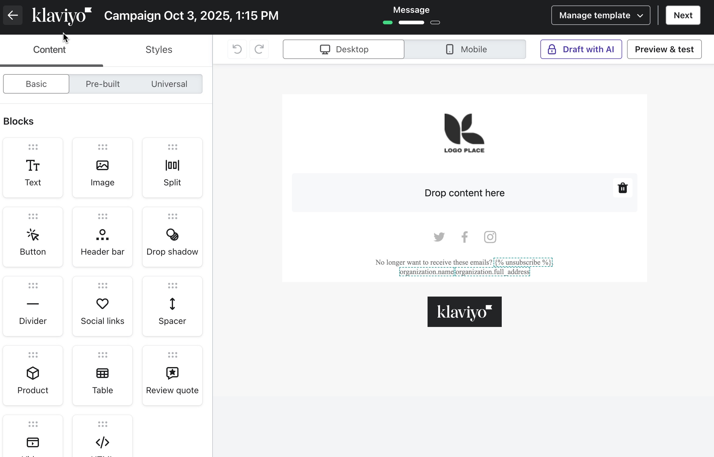

# Klaviyo Email Template Builder

Driving B2C marketers to commerce x AI
From this

To this


try it here:
https://athensf.github.io/klav-2/

## 🎨 Features

### **Drag-and-Drop Interface**
- **14 Content Blocks**: Text, Chat agent, Image, Split, Button, Header bar, Drop shadow, Divider, Social links, Spacer, Product, Table, Review quote, Video, and HTML
- **2 Layout Options**: Multi-column layout templates
- **Visual Feedback**: Smooth animations with 0.5 opacity during drag, dashed border highlight on drop zone
- **Block Management**: Easy deletion with hover states and remove buttons

### **Chat Agent Block**
- **Custom Placeholder**: Displays "What can we help you find today?" when dropped
- **Typewriter Animation**: Text types out character-by-character with blinking cursor effect
- **2-second typing animation** with 35-step progression for realistic effect

### **AI Indexability Toggle**
- **Sliding Toggle Switch**: Smooth 0.3s transition between ON/OFF states
- **Visual States**:
  - OFF: Light grey background (#ddd)
  - ON: Dark grey background (#555)
- **Info Tooltip**: Hover over the "i" icon for detailed explanation
- **Session Persistence**: State stored in JavaScript variable during session
- **Console Logging**: Tracks state changes for debugging

### **Responsive Toolbar**
- **Content/Styles Tabs**: Switch between editing modes
- **Undo/Redo Controls**: Grey SVG icons with proper accessibility labels
- **Desktop/Mobile Toggle**: Preview responsive layouts
- **Draft with AI**: Lock icon with greyscale styling
- **Preview & Test**: Quick access to preview mode

### **Greyscale Design System**
- **Strict Colour Palette**: Pure greyscale throughout (#000 to #fff)
- **Consistent Spacing**: 16px grid system
- **Typography**: System font stack with precise sizing (10px-18px range)
- **Block Tiles**: 75×75px with 6px border-radius, 12px gaps
- **Hover States**: Border colour transitions from #ddd to #999

### **Email Canvas**
- **Max Width**: 600px centered container
- **Drop Zone**: Dashed border (#ccc) with hover state (#999)
- **Logo Placeholder**: 30×30px black leaf icon with "LOGO PLACE" text
- **Trash Icon**: 20×20px SVG with hover background
- **Smooth Insertions**: 180ms fade-in animation for dropped blocks

### **Footer Elements**
- **Social Icons**: 20×20px greyscale SVGs (Twitter, Facebook, Instagram)
- **Unsubscribe Link**: Styled in grey with hover states
- **Klaviyo Branding**: Logo image with transparent background

### **Sidebar Organization**
- **Fixed Width**: 290px with 20px padding
- **Three Tabs**: Basic, Pre-built, Universal
- **Block Grid**: 3-column layout with consistent spacing
- **Layout Grid**: 2-column layout for column templates
- **Drag Handles**: Six-dot indicators (⋮⋮) on all draggable items

## 🛠️ Technical Implementation

### **Pure Vanilla Stack**
- No frameworks or libraries
- Self-contained single HTML file
- Inline CSS and JavaScript
- ~900 lines of code

### **Animations**
- CSS keyframe animations for typewriter effect
- Smooth transitions (0.2s-0.3s) on interactive elements
- Transform-based slider animation for toggle switch

### **Accessibility**
- ARIA labels on interactive elements
- Semantic HTML structure
- Keyboard-accessible toggle controls
- Proper alt text on images

### **Browser Compatibility**
- Modern CSS features (flexbox, grid, CSS variables)
- Native HTML5 drag-and-drop API
- Works in all modern browsers (Chrome, Firefox, Safari, Edge)

## 📁 Project Structure

```
klav-2/
├── index.html          # Main application file
├── logo.jpg           # Klaviyo logo image
└── README.md          # This file
```

## 🚀 Getting Started

1. **Clone or download** the repository
2. **Open `index.html`** in your web browser
3. **Start building** by dragging blocks from the sidebar to the canvas

No build process, no dependencies, no installation required!

## 💡 Usage

### Adding Content Blocks
1. Select a block from the left sidebar
2. Drag it to the drop zone in the canvas
3. Release to insert the block
4. Click the × button to remove blocks

### Using the Chat Agent
- Drag the "Chat agent" block to see the animated typewriter effect
- Perfect for interactive email elements

### Toggling AI Indexability
1. Click the toggle switch in the toolbar
2. Hover over the "i" icon for more information
3. Check the browser console to see state changes

## 🎯 Design Principles

- **Minimalist**: Pure greyscale aesthetic
- **Intuitive**: Familiar drag-and-drop interaction
- **Performant**: No external dependencies
- **Accessible**: WCAG-compliant interactive elements
- **Responsive**: Adapts to different viewport sizes

## 📝 Customization

All styling is contained in the `<style>` block within `index.html`. Key CSS variables and classes:

- **Colours**: #000, #1a1a1a, #2d2d2d, #333, #444, #555, #666, #777, #999, #aaa, #ccc, #ddd, #eee, #f5f5f5, #f9f9f9, #fff
- **Spacing**: 8px, 12px, 16px, 20px, 30px, 40px
- **Border Radius**: 4px, 6px, 8px, 12px
- **Transitions**: 0.2s-0.3s ease

## 🔧 Future Enhancements

- [ ] Save/load templates to localStorage
- [ ] Export to HTML email format
- [ ] More block types (countdown, accordion, etc.)
- [ ] Block styling options panel
- [ ] Undo/redo functionality
- [ ] Mobile-responsive preview mode
- [ ] Copy/duplicate blocks
- [ ] Reorder blocks via drag-and-drop

## 📄 License

This project is open source and available for educational purposes.

---

**Built with ❤️ using vanilla JavaScript, CSS, and HTML**
https://athensf.github.io/klav-2/